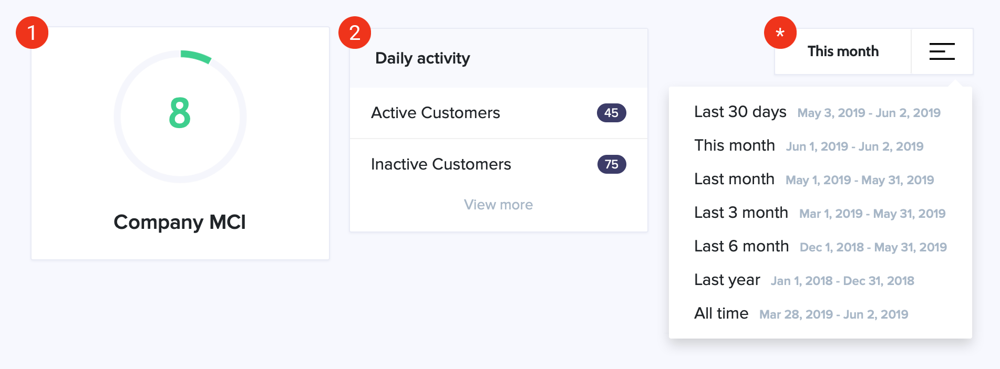
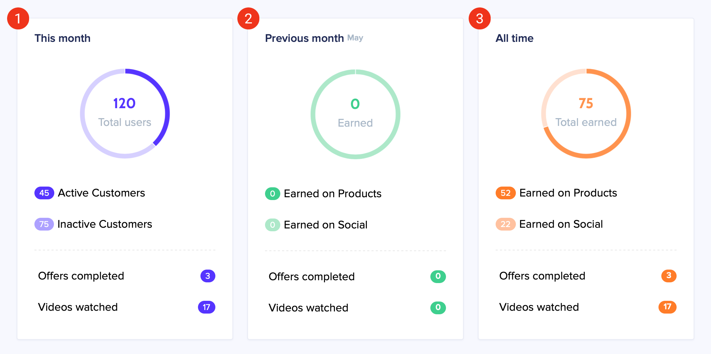
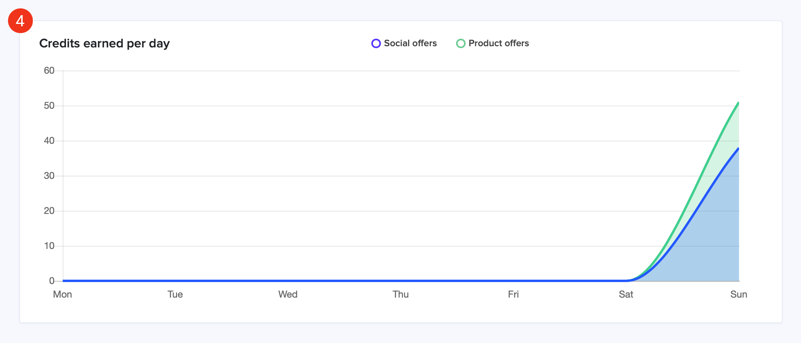
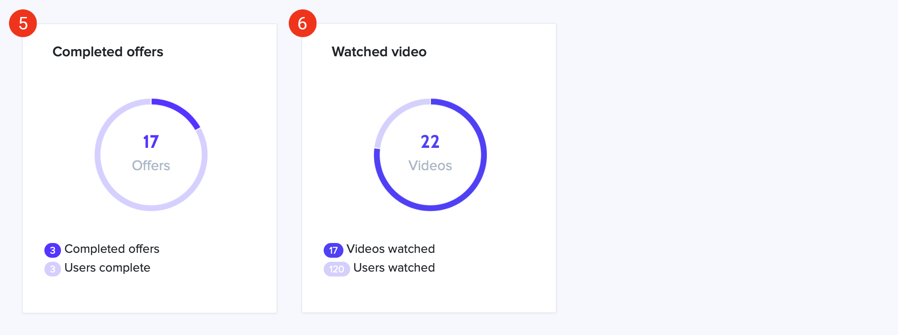
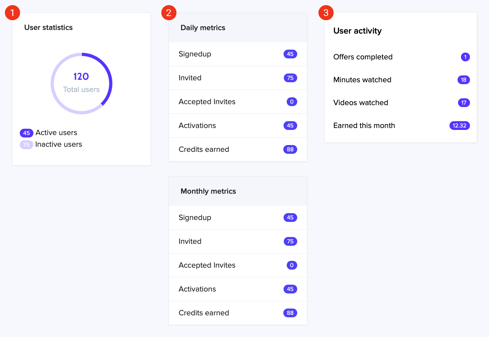
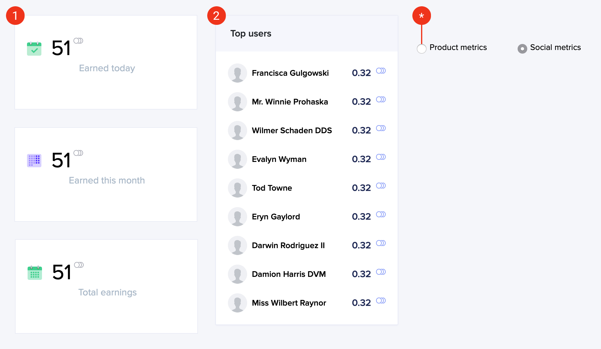
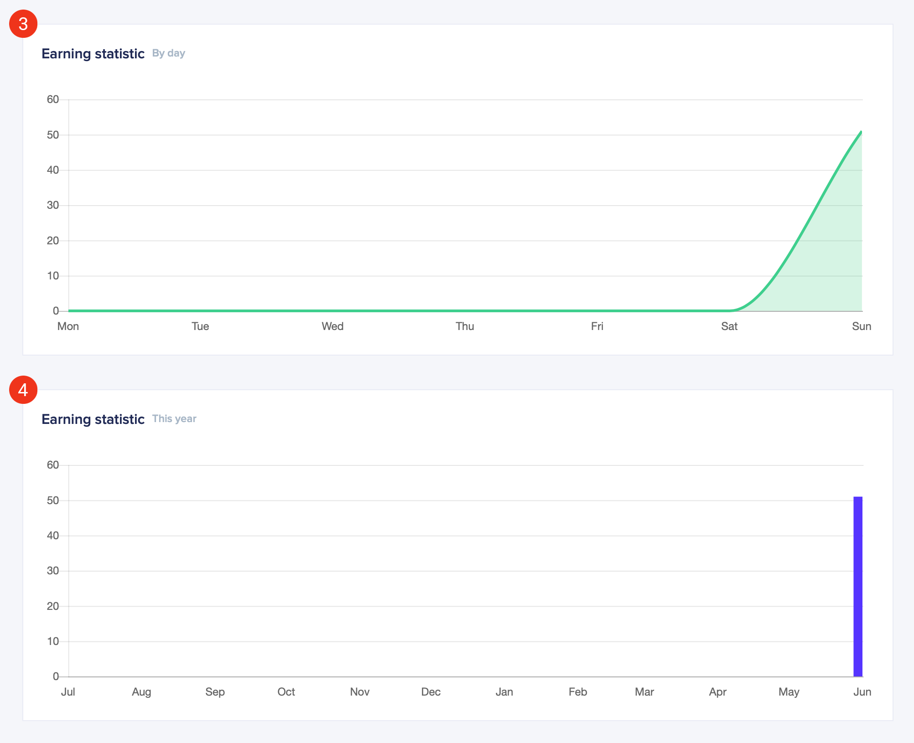
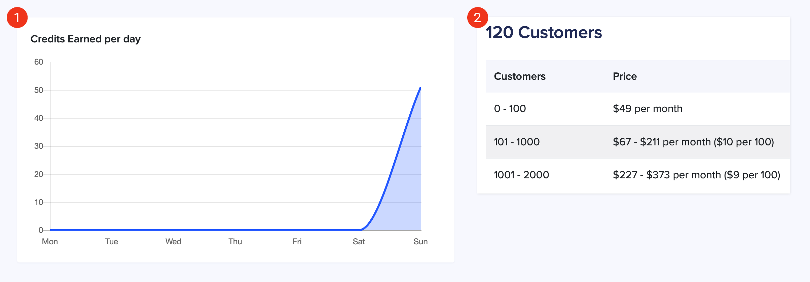
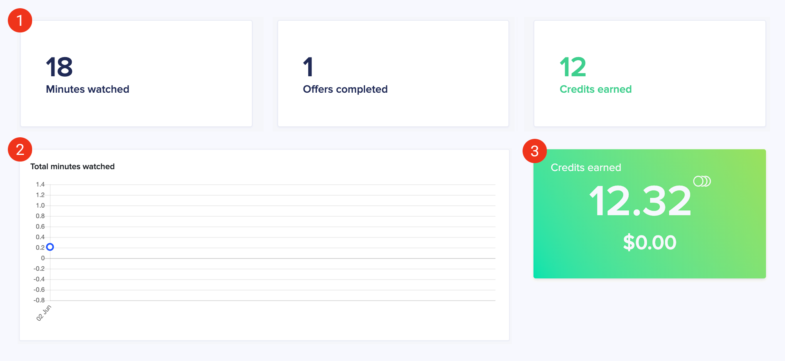
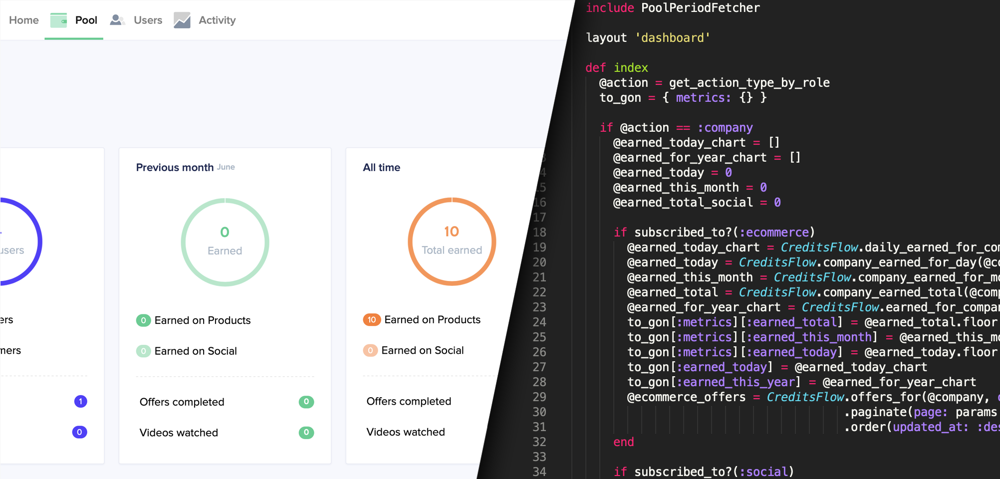

# Company Metrics

### Table of contents:

* **Company Metrics**
  * [Home](#dashboard---home)
  * [Pool](#dashboard---pool)
  * [Users](#dashboard---users)
  * [Activity](#dashboard---activity)
  * [Settings](#dashboard---settings)
* **Customer Metrics**
  * [Activity](#customer-metrics)
* **Additional Things**
  * [Products](#the-collision-of-products-with-ecommerce)

## Dashboard - Home



### 1. Company MCI

**Description:** The total number of scores received through the badge system. Badges - an associated object with the name and score values, which is assigned when the company passes the following milestones:

* Registration in the application
* Subscribed to the payment plan: social, products or bundle
* Connected external service: stripe, shopify, youtube, facebook, vimeo
* Customer base growth: 91 badges from 100 to 10k clients

**Logic:** The value proceed from the `mci` method of `Company` model, which calculates the sum of scores for associated objects.

**The molds:**

```ruby
Badge(
  id: integer,
  name: string,
  score: integer
)

CompaniesBadge(
  id: integer,
  badge_id: integer,
  company_id: integer
)
```

### 2. Daily activity

**Description:** Displays two values, active and inactive clients that have been registered, invited or imported today. The behavior of this block will be changed if the user sets a date period **( * )**.

* Active: a client who added PayPal account
* Inactive: a client whithout PayPal 

**Logic:** Company customer is sampled through two scopes of the `User` model with using the associated model `ActiveCompanyUser`:

For active customers:
1. First scope `active_users` where `active_company_users.paypal_email` is not `nil`.
2. Second scope `active_today` where `paypal_added_at` date of `ActiveCompanyUser` is today.

For inactive customers:
1. First scope `inactive_users` where `active_company_users.paypal_email` is `nil`.
2. Second scope `customers_today` where `created_at` date of `ActiveCompanyUser` is today and `source` in `%w[invite registration]`.

**The mold of** `ActiveCompanyUser`:

```ruby
ActiveCompanyUser(
  id: integer
  company_id: integer
  user_id: integer
  source: string
  activation_token: string
  activated_at: datetime
  created_at: datetime
  updated_at: datetime
  paypal_email: string
  paypal_added_at: datetime
  is_imported: boolean
  imported_from_account: integer
)
```
### ( * ). Date period

**Description:** After setting a period of dates, the metrics of this block cease to be today and display information within the chosen period.

**Logic:** When the `from` and `to` parameters appear in the URL, variables are reassigned for the second scope at the controller level.

* Active customers use `active_in_range` where `active_company_users.paypal_added_at` date is in the range
* Inactive customers use `customers_in_range` where `active_company_users.created_at` date is in the range and `source` in `%w[invite registration]`

## Dashboard - Pool



### 1. This month

**Description:** The first half of this section is about customer growth and contains three indicators - active, inactive and total customers who joined within a current calendar month. The second part about social and products activity which contains the number of completed offers and watched videos in the same period.

**Logic:** Total users section has two variable at the controller level:

* Total number of users uses method `customers_without_owners` of `User` model, then `customers_this_month` scope where `active_company_users.created_at` date within a current calendar month and `source` in `%w[invite registration]`.

* Active customers also uses `customers_without_owners`, then two scopes `active_users` and `active_this_month` where `paypal_added_at` date within a current calendar month.

* Inactive users are the result of subtracting `@active_users` from `@total_users` at the view level.

**Completed offers** come from the `offers_completed_count_for` method of `CreditsFlow` model, which counts the number of associated objects where `source` equivalent to `stripe` or `shopify`. Also, this method has a `period` option, which provides a period of dates for `created_at`.

**Watched videos** come from the `company_videos_watched` method of `CreditsFlow` model, which counts the number of associated objects where `reference_id` grouped by `company.videos.map(&:id)` and has `from` and `to` options, which provides a period of dates for `created_at`.

**The mold of** `CreditsFlow`:

```ruby
CreditsFlow(
  id: integer,
  user_id: integer,
  company_id: integer,
  reason: string,
  operation_type: string,
  amount: float,
  created_at: datetime,
  updated_at: datetime,
  credits: float,
  source: string,
  month: integer,
  reference_id: string,
  month_start: datetime,
  month_end: datetime
)
```

### 2. Previous month

**Description:** The first half of this section is about customer credits earned during the previous calendar month, which divided into Social and Products activity. The second part displays the same data as in the [this month](#1-this-month) section but within the previous calendar month.

**Logic:** Earning activity.

* Earned on Products and Social uses `company_earned_for_month` method of `CreditsFlow` model, which has the `type` parameter to select social or product offers result. Then `company_earned_for_month` is calculated results by private method `sum`.


* The same method returns the total if the `type` parameter is empty.

Fetching activity rates for the second part uses methods from [this month](#1-this-month) section but with other date period options:

* `offers_completed_count_for` - `period` option as `'prev_month'`
* `company_videos_watched` - `from:` option as `now.prev_month.beginning_of_month` and `to:` as `now.prev_month.end_of_month`

### 3. All time

**Description:** Display the same data as in a previous section from the company registration date to the current day.

**Logic:** For all variables (eCommerce, Social, Total) uses `company_earned_total` method of `CreditsFlow` model. That performs identical logic as in `company_earned_for_month` but without specifying `from` and `two` options calculates result for the entire period.



### 4. Credits earned per day

**Description:** Displays a graph with Social and Products activities for the previous seven days.

**Logic:** Generates two arrays (eCommerce and Social) at the controller level and sends this data to the front side through `to_gon[:pool_chart_data_ecommerce]` and `to_gon[:pool_chart_data_social]`.

To generate data uses `daily_earned_for_company` method of `CreditsFlow` model, which selects data for the previous seven days and forms it into an array of hashes using the private method `prepare_for_chart`. The hash has two keys:

* `:t` - date in `yyyy/mm/dd` format
* `:y` - amount of credits received for that day

**The mold of results:**

```
[
  { :t=>"2019-05-30", :y=>0 },
  { :t=>"2019-05-31", :y=>0 },
  { :t=>"2019-06-01", :y=>0 },
  { :t=>"2019-06-02", :y=>0 },
  { :t=>"2019-06-03", :y=>0 },
  { :t=>"2019-06-04", :y=>0 },
  { :t=>"2019-06-05", :y=>0 }
]
```



### 5. Completed offers

**Description:** Displays the Products activity of customers during the current calendar month.

**Logic:** 

* **Offers** -  the total number of the company offers received from `company.offers.ecommerce.count`
* **Completed offers** -  uses `@offers_completed` from [this month](#1-this-month) block
* **Users complete** - come from the `users_completed_count_for` method of `CreditsFlow` model, which counts the number of associated objects where result grouped by `user_id`

**The mold of** `Offer`:

```ruby
Offer(
  id: integer,
  url: string,
  title: string,
  description: string,
  price: integer,
  created_at: datetime,
  updated_at: datetime,
  image_file_name: string,
  image_content_type: string,
  image_file_size: integer,
  image_updated_at: datetime,
  company_id: integer,
  offer_type: string,
  no_expiration_date: boolean,
  expiration_date: datetime,
  offer_kind: string
)
```

### 6. Watched video

**Description:** Displays the Social activity of customers during the current calendar month.

**Logic:** 

* **Videos** - the total number of the company videos received from `company.videos.published.count`
* **Videos watched** - uses `@videos_watched` from [this month](#1-this-month) block
* **Users watched** - come from the `users_watched` method of `VideoLog` model, which counts the number of company customers who have this object with `rewarded` as `true` and `created_at` date is in the range

**The mold of** `VideoLog`:

```ruby
VideoLog(
  id: integer,
  video_id: string,
  created_at: datetime,
  updated_at: datetime,
  user_id: integer,
  from: integer,
  to: integer,
  provider: string,
  client_type: integer,
  processed_by_analyzer: boolean,
  rewarded: boolean
)
```

## Dashboard - Users



### 1. User statistics

**Description:** Displays information about the total number of customers which contains three indicators - active, inactive and total customers who signed up during the existence of the company account.

**Logic:**

Repeats the logic of the [this month](#1-this-month) section on the pool page, but does not use the `customers_this_month` and `active_this_month` scopes.

### 2. Daily and monthly metrics

**Description:** The first four lines of this sections are about customer growth and contain following indicators: signedup, invited, accepted invites and activations during the current day or calendar month. The last line it's credit earnings from social and products activity during the same periods.

**Logic:** Uses `customers_without_owners` method of `User` model to get the number of customers, then applies the following scopes to clarify data:

* **Daily metrics**
  * Signedup: `customers_today` where `source` is `'registration'`
  * Invited: `customers_today` where `source` is `'invite'`
  * Accepted Invites: `accepted_today` where `accepted_invite` is `true`
  * Activations: `active_today` where `paypal_added_at` is today
* **Monthly metrics**
  * Signedup: `customers_this_month` where `source` is `'registration'`
  * Invited: `customers_this_month` where `source` is `'invite'`
  * Accepted Invites: `accepted_this_month` where `accepted_invite` is `true`
  * Activations: `active_this_month` where `paypal_added_at` during the current month

**\*** The logic of these scopes is described in the [daily activity](#2-daily-activity) section of the home page.

**Credits earned** lines come from the `company_earned_for_month` and `company_earned_for_day` methods of `CreditsFlow` model, whose logic is described in the [previous month](#2-previous-month) section of the pool page.

### 3. User activity

**Description:** Metrics are in a modal bar that is available after selecting a user from the list. Displays a customer activity from the date of registration and the number of credits earned during the current pool period.

**Logic:** These metrics go to the front side through the `Api::UserLibraryController`, which combine  the following methods:

* **Offers completed** come from the `offers_completed_count_for` method of `CreditsFlow` model with `all_time` period, more details in the [completed offers](#1-this-month) section of the pool page.

* **Minutes watched** come from the `user_minutes_watched` method of `CreditsFlow` model, which uses `user_social`**\*** scope and returns the sum of the `amount`
* **Videos watched** come from the `user_videos_watched_count` method of `CreditsFlow` model, also uses scope `user_social` then grouping result by `reference_id` and returns a count of unique objects

* **Earned this month** come from the `balance_in_credits` of `User` model, which return last `balance` of `UserBalance` model within a current pool period (`month_start` and `month_end`)**\*\***.

**\*** `CreditsFlow` objects where `source` equivalent to `youtube`, `facebook` or `vimeo`.

**\*\*** To fetching current pool period, uses `period_date_start` and `period_date_end` methods of the `PoolService`.

**The mold of** `UserBalance`:

```ruby
UserBalance(
  id: integer,
  user_id: integer,
  balance: float,
  created_at: datetime,
  updated_at: datetime,
  company_id: integer,
  month: integer,
  rewarded_by_pool: integer,
  month_start: datetime,
  month_end: datetime
)
```

## Dashboard - Activity



### 1. Credit earnings

**Description:** Displays daily, monthly (calendar) and total credit earnings of the company customers.<br>
Depends on the selected type of activity **( * )**.

**Logic:**

Uses `company_earned_for_day`, `company_earned_for_month` and `company_earned_total` methods of `CreditsFlow` model, whose logic is described in the [previous month](#2-previous-month) section of the pool page.

### 2. Top users

**Description:** Customers with the maximum amount of earned credits. Forming of the list depending on the state of the pool, and has the following case:

1. Without pool histories:

    > Taken into account customer earnings from the company registration date to today.

2. When the pool is open:

    > Taken into account customer earnings within the pool period dates.

3. When the pool is not open, but a previous history exists:

    > Taken into account customer earnings from the previous pool start to today. If the customer had new earnings after closing the previous pool, they will be merged.

**Logic:**

The selection of the date range occurs at the controller level through `period_for_top` method of `PoolPeriodFetcher` concern, it checks the following cases:

1. If no `PoolHistory` found, returns range from `company.created_at` to `Time.now`.

2. If `PoolHistory` where `rewarded_at` is `nil` exists, returns range within the pool period.

3. If all histories already `rewarded_at`, obtains a `filled_at` date from `previous_periods` method of `PoolHistory` model and sets `plurality` as `true`, which means - customer earnings must be merged.

Then we send the received range to the `in_date_range` scope of `UserBalances` model and print these result through `ActivityHelper.print_top_users` helper at the view level.

**The mold of** `PoolHistory`:

```ruby
PoolHistory(
  id: integer,
  amount: integer,
  stripe_charge_id: string,
  filled_at: datetime,
  rewarded_at: datetime,
  proportions: json,
  created_at: datetime,
  updated_at: datetime,
  company_id: integer,
  reward_at: datetime
)
```

### ( * ). Type of activity

Allows you to change the type of displayed activity for all page metrics, except the top users bar. The default value is Products.



### 3. Earning graph: By day

**Description:** Displays a graph with Social or Products earnings for the previous 7 days.<br>
Depends on the selected type of activity **( * )**.

**Logic:**

Uses the `daily_earned_for_company` method of `CreditsFlow` model, whose logic is described in the [credits earned per day](#4-credits-earned-per-day) section of the pool page.

### 4. Earning graph: This year

**Description:** Displays a graph with Social or Products earnings for the last 12 months.<br>
Depends on the selected type of activity **( * )**.

**Logic:** Generates two arrays (eCommerce and Social) at the controller level and sends this data to the front side through `to_gon[:earned_this_year]` and `to_gon[:earned_this_year_social]`

To generate data uses `earned_for_company_this_year` method of `CreditsFlow` model, which have same logic of the work and the format of the arrays are identical to [`daily_earned_for_company`](#4-credits-earned-per-day).

## Dashboard - Settings



### 1. Pool Billing page

**Description:** Displays a graph with credit earnings of the company customers for the previous seven days.

**Logic:**

The same [graph](#4-credits-earned-per-day) as on the pool page, which uses `'both'` type for `daily_earned_for_company` method of `CreditsFlow` model.

### 2. Payment Plan page

**Description:** The total number of company customers that affect the amount of the monthly payment. All users are counted, including inactive and recent invited.

**Logic:**

Company customer is sampled through the `customers` scope of the `User` model, which use `with_role_for_instance` of `RolifyAddons` concern.

# Customer Metrics



### 1. Minutes, Offers and Credits

**Description:** Displays user activity during the current pool period. Contains three section - number of watched minutes, completed offers and amount of credits received from these activities.

**Logic:**

The same metrics as into a [modal bar](#3-user-activity) of the user library page, but `offers_completed_count_for` and `user_minutes_watched` of `CreditsFlow` model use the pool period dates.

### 2. Total minutes watched

**Description:** Displays a graph with total credit earnings from the Social activity.

**Logic:** Generates an array with one hash inside at the controller level and sends this data to the front side through `to_gon[:watched_videos_chart]`.

To generate data uses `user_minutes_watched_chart` method of `VideoLog` model, which calculates viewed seconds with `rewarded` is `true` and then converts the result into credits. The result has one hash with the following keys:

* `:t` - today's date in format `yyyy/mm/dd`
* `:y` - amount of credits received from viewed seconds

**The mold of results:**

```
[
  {
    :t=>"2019-06-02",
    :y=>"0.214"
  }
]
```
### 3. Balance on the home page


**Description:** Displays amount of credits received during the current pool and dollar balance from previous periods.

**Logic:** 

* Credits balance logic is described in the [user activity](#3-user-activity) section of the user library page.

* Dollar balance comes from the `balance_for` method of `PoolReward` model, which calculates the sum of `amount` for these objects.

**The mold of** `PoolReward`:

```ruby
PoolReward(
  id: integer,
  user_id: integer,
  company_id: integer,
  pool_history_id: integer,
  amount: integer,
  operation_type: string,
  created_at: datetime,
  updated_at: datetime
)
```

# Additional Things



### The collision of "Products" with "eCommerce"

**Problem:** You could pay attention to the inconsistency of terminology between the front side and program code, namely - "Product offers" vs "eCommerce". Initially, the project used the concept of "eCommerce" and it affected most of the code parts such as models and their methods, scopes, variable naming, etc.

But over time, it was decided to leave this concept and use "Products" (the reason you can find in [this card](https://trello.com/c/8nDtSJpi)). Due to the fact that this term affects a really huge area of ​​the application, only the front side was updated.

> For example, `Company` model has an argument `package_subscribed` where value is `'ecommerce'`, but for the front side, it means “Products” subscription.

**The main thing** you need to understand: any mentions about "Products" or "Product offers" of the site, on the code side will be called "ecommerce", and vice versa.