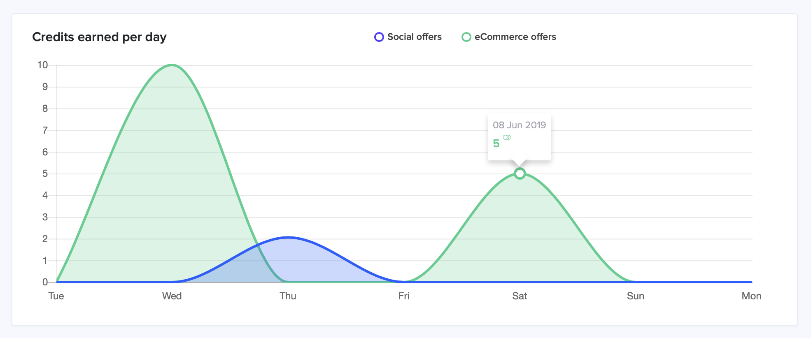

# TimeMachine Service

### Table of contents

* [Initialization](#initialization)
* [Printers](#printers)
* [Time Traveling](#time-traveling)
* [Pool Operation](#pool-operation)
* [Activity Operation](#activity-operation)

### Overview

This service providing "time travel" capabilities, which will allow you to open a pool or generate customer activity within specific time intervals to test time-dependent cases or application metrics.

**Note:** It is important to understand that this service **does not use** most of the application logic, such as `PoolService`, workers or external integration like Stripe and is not intended for testing these things. TM about atypical data generation and in other cases, you should use `TestPoolService`.

**Files overview:**

```
    .
    │
    ├── time_machine
    │     │
    │     ├── builder.rb        # Initialization, printers and "time travel" providing
    │     ├── pool.rb           # Pool filling, rewarding and reset methods
    │     ├── activity.rb       # Social / eCommerce activity and user creation
    │     ├── stuff.rb          # All TM objects are created here
    │     └── reply.rb          # Responsible for terminal replies and printers
    └── ...
```

## Initialization

Open a rails console:

```
make console
```

Service initialization, where `1` is the company's id:

```ruby
$ tm = TimeMachine::Builder.new(1)
```

You also can print a list of existing companies with ID and subdomain without initialization:

```ruby
$ Company.pluck(:id, :subdomain) #=> [[1, "teral"], [2, "nil"]]
```

## Printers

The service has few commands to display useful information in formatted form:

```ruby
$ tm.commands           # list of available commands
$ tm.print_users        # company customers, which contain [id], [email], [full_name]
$ tm.print_videos       # company videos, which contain [id], [identifier], [title]
$ tm.print_deleted      # deleted videos, which contain [deleted_at], [identifier], [title]
$ tm.print_companies    # available companies, which contain [id], [created_at], [subdomain]
```
Return example:

```
-------------------------------------------------------------------------------------

LIST OF AVAILABLE COMPANIES:

ID: 1 | 2019-03-28 10:29:19 UTC    teral 
ID: 2 | 2019-04-15 22:40:49 UTC    nil
ID: 3 | 2019-04-16 00:43:13 UTC    second-nil
ID: 4 | 2019-04-18 21:08:23 UTC    social
ID: 5 | 2019-04-20 20:51:49 UTC    demo-company
ID: 6 | 2019-04-25 20:31:33 UTC    youtube

-------------------------------------------------------------------------------------
```

## Time Traveling

The main idea is to open or close the pool in a specific period of time without reference to the company registration date. You can also generate activity or customer activations at any time during the pool period.

Suppose a situation when we need to create a specific activity for "Credits earned per day" graph on the pool page. For example, we have to get 10 credits on Wednesday from ecommerce, 2 credits on Thursday from social and 5 credits on Saturday from ecommerce. Our actions:

> 1. Go to the past for **6** days
> 2. Create ecommerce activity, amount is **10** credits
> 3. Go to the future for **1** days
> 4. Create social activity, amount is **2-ish** credits
> 5. Go to the future for **2** days
> 6. Ecommerce activity again, amount is **5** credits
> 7. Back in the present, in this example, it's Monday



**How it works**

The service has following commands for move forward, backward or specific in time:<br>
Go to the future for _N_ days:

```ruby
$ tm.goto(future: 10) # where 10 is number of days
```

Go to the past for _N_ days:

```ruby
$ tm.goto(past: 20)   # where 20 is number of days
```

Go to the ruby [Date class](https://ruby-doc.org/stdlib-2.4.1/libdoc/date/rdoc/Date.html):

```ruby
$ tm.goto(system: Date.today.end_of_year) # where date is the end of this year
```

Back in the present:

```ruby
$ tm.goto(backup: true)
```

After using `goto` commands, TM will display a new current date.<br> Moreover, you can find out what date is today with:

```ruby
$ Date.today #=> Mon, 10 Jun 2019
```

## Pool Operation

The service has following commands for open, close or resets a pool. Also, you will receive overview information on the results of these operations:

* **Fill:** entity and charge ids, start and end date
* **Reward:** amount of credits, award date, user list with a dollar amount
* **Reset:** type and number of deleted entities

To open a pool in the current date:

```ruby
$ tm.pool.fill
# if the pool already exists, you'll see a warning message
```

To closing the pool and distribution rewards in the current date:

```ruby
$ tm.pool.reward
# if the pool is not filled, you'll see a warning message 
```

To clear the pool history and other data:

**Note:** _You'll delete not only a specific pool but also all previous data, including the following objects `VideoLog`, `PoolReward`, `UserBalance`, `CreditsFlow`, `PoolHistory` and optional `User`._

```ruby
$ tm.pool.reset
$ tm.pool.reset(true) # save customer accounts
```

## Activity Operation

For creation activity or new customers use the following commands. Also, you will receive overview information on the results of these operations:

* **Users:** list of the company customers in a [printer](#printers) format
* **Paypal:** email and date used to activate
* **Social and Ecommerce:** amount and date of earned credits

### New customers

To add new active customers in the current date:

```ruby
$ tm.activity.users     # 5 active customers
$ tm.activity.users(10) # certain amount of customers
```

For the case when you need to add inactive (invited) customers:<br>
_**\*** 5 - number of customers must be specified_

```ruby
$ tm.activity.users(5, invited: true) # 5 inactive customers
```

For the case when you need to activate a specific customer today:

```ruby
$ tm.activity.paypal(1) # 1 as user_id
```

### Social and Ecommerce activity

For the case when each customer watched all video:

```ruby
$ tm.activity.social
```

For the case when a specific customer watched a specific video:

```ruby
$ tm.activity.social(1, 10) # 1 as user_id, 10 as video_id
```

For the case when a specific customer made a payment through Stripe:

```ruby
$ tm.activity.ecommerce(1, 1000) # 1 as user_id, 1000 as amount is in cents
```

